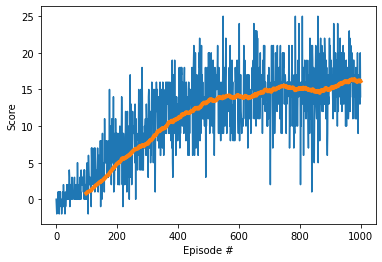

# Project 01: Navigation
## Learning Algorithm
### Agent
is more or less similar to the agent we have in the DQN excercise
- Two DQN (local and target) using the simple neural network with 3 layers
- using Replay memory with class ReplayBuffer
- using Epsilon-greedy with decay epsilon after each episode
- Loss function is MSE_loss function
- Optimization is done by Adam optimizer
### Model Architecture
- Both local and target DQN are implemented with same class  **QNetwork** which has 3 fully connected layers and 2 RELU layers. I implement a simple method to random choose the number of neurons fc1 and fc2 to check the effect of them on the results.
### Hyperparameters
- Other than number of neurons for each layer, I also play with epsilon by choosing the `epsilon_start`. Other hyperparameter `BUFFER_SIZE`, `BATCH_SIZE`,... left untouched.
## Result
From the training performance we choose the following network architectures and hyperparamter:
- fc1 layer with: 48 neurons
- fc2 layer with: 56 neurons
- Epsilon start: 0.99
It achives the reward goal 13 for a rolling windows of 100 episodes after: 481 episodes

## Ideas for Future Work
- I have hard time to do this project since my company laptop is not allowed to install or run any other softwares than from software pool, and it constantly deleted the Banana.exe for safety purpose, Udacity server is not stable this week, I'm in and out then in the queue again for couple of times, so I only take my super old laptop and barely can run the training for half a day. All I can do is tweaking the vanilla version from DNQ excercise a little bit, and it works. I want to do more such as:
1. For short period:
- Implement different neural network architectures: adding more layers, change the number of neurons for each layer to see the improvement.
- For now the choosen hyperparameter is from the result, no analysis yet to have the relation between hyperparameters and result. I only manage to run 10 iterations which take 1 full day, and 3 of them repeat the same set of parameters.
- I never run this with visual environment (it freezes my laptop), may be I will focus on solve the hardware issue 
2. For long period:
- Implement the [double DQN](https://arxiv.org/abs/1509.06461), [dueling DQN](https://arxiv.org/abs/1511.06581) and [prioritized experience replay](https://arxiv.org/abs/1511.05952) - like suggesting
- Go for extra challenge: Learning from Pixels - after I have solution for my hardware problem.
## Submitted files
- [x] README.md
- [x] Report.md
- [x] Navigation.ipynb
- [x] dqn_agent.py
- [x] model.py
- [x] checkpoint.pth - achieve best result after training
- [x] scores.png
