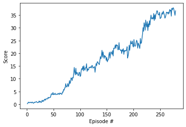
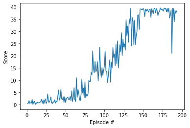

# Project 02: Continuous Control
## Learning Algorithm
### Agent
This agent is based on the DDPG algorithm, which is adapted from the pedulum exersice.
### Model Architecture
Both the **actor** and **critic** neural network of DDPG algorithm are build the same way for training multiple and single agent: with 3 fully-connected layers and 2 rectified nonlinear layers. 
The number of neurons of the fully-connected layers are as follows:

for the **actor**:   
Layer fc1, number of neurons: state_size x fc1_units,   
Layer fc2, number of neurons: fc1_units x fc2_units,    
Layer fc3, number of neurons: fc2_units x action_size,

for the **critic**:   
Layer fcs1, number of neurons: state_size x fcs1_units,  
Layer fc2, number of neurons: (fcs1_units+action_size) x fc2_units,   
Layer fc3, number of neurons: fc2_units x 1. 

Here, the input parameters fc1_units, fc2_units, fcs1_units are all taken = 128. 
### Hyperparameters
We have more or less the same hyperparameters for training multiple or single agent. Below show the hyperparameters for training multiple agents, 2 last parameters are only for multiple agents training.
```python
     BUFFER_SIZE = int(1e6)  # replay buffer size
     BATCH_SIZE = 256        # minibatch size
     GAMMA = 0.99            # discount factor
     TAU = 1e-3              # for soft update of target parameters
     LR_ACTOR = 1e-3         # learning rate of the actor
     LR_CRITIC = 1e-3        # learning rate of the critic
     WEIGHT_DECAY = 0        # L2 weight decay
     EPSILON = 1.0           # epsilon noise parameter
     EPSILON_DECAY = 1e-6    # decay parameter of epsilon
     LEARNING_PERIOD = 20    # learning frequency
     UPDATE_FACTOR   = 10    # how much to learn
```
Like mentioned in the project guide, the `LEARNING_PERIOD` and `UPDATE_FACTOR` is set for **convergence** of the training
## Result
For training with multiple agents, we achive the reward goal 30 for a rolling windows of 100 episodes after: 279 episodes



For training with single agent, I achive the reward goal 30 for a rolling windows of 100 episodes after: 193 episodes



The result with muliple agents training is more stable than the single agent training, average learning reduces the noise in the result. I also notice that training with multiple agent even run faster than with single agent, but not really sure.

I notice that the results training for multiple or single agent are completely exchangable, even with critic or actor.

## Ideas for Future Work
- I also notice reproducibility, and sensitivity with this DDPG regard to hyperparameters, and model. I only play with different neuron per layer, and some parameters. 
- Benchmarking with other algorithms: TRPO, TNPG, PPO and D4PG
- Challenge: Crawl
## Submitted files
- [x] checkpoint_actor.pth
- [x] model.py
- [x] checkpoint_actor_solved_single.pth
- [x] README.md
- [x] checkpoint_critic.pth
- [x] Report.md
- [x] checkpoint_critic_solved_single.pth
- [x] RUNAgent_single.ipynb
- [x] Continuous_Control_multi.ipynb
- [x] RUNAgents_multi.ipynb
- [x] Continuous_Control_single.ipynb
- [x] scores_multi.png
- [x] ddpg_agent_multi.py
- [x] scores_single.png
- [x] ddpg_agent.py

