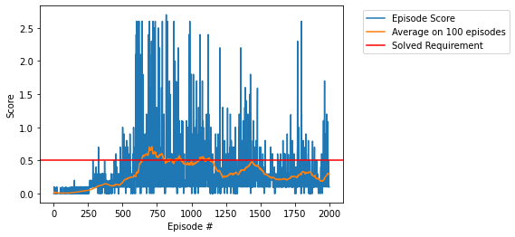

# Project 03: Collaboration and Competition
## Learning Algorithm
### Agent
In this project, I use the `MADDPG` which is Multi-Agents `DDPG` algorithm to train two agents control rackets to bounce a ball over a net. Each agent is based on the `DDPG` algorithm (Deep Deterministic Policy Gradient), which is adapted from the pedulum exersice and has been discussed in the Project 2.

The difference is here we train 2 agents and the agents need to **collaborate** (don't let the ball hit the ground) and **compete** (gather as many point as possible). For that purpose, two agents were trained independently but with a shared experience memory buffer.

### Model Architecture
Each agent has its own set of deep neural networks (local and target; actors and critics), with 3 fully-connected layers and 2 rectified nonlinear layers and tanh on the output layers. 

The number of neurons of the fully-connected layers are as follows:

for the **actor**:   
Layer fc1, number of neurons: state_size x fc1_units,   
Layer fc2, number of neurons: fc1_units x fc2_units,    
Layer fc3, number of neurons: fc2_units x action_size,

for the **critic**:   
Layer fcs1, number of neurons: state_size x fcs1_units,  
Layer fc2, number of neurons: (fcs1_units+action_size) x fc2_units,   
Layer fc3, number of neurons: fc2_units x 1. 

Here, the input parameters fc1_units, fc2_units, fcs1_units are = 256, 128 and 256. 
### Hyperparameters
We choose learning rate of 1e-3 on each DNN and batch size of 128 along with replay buffer size of 1e6, gamma .99 and Tau of 6e-2. Each agent takes one action, receives the state and reward, then updates once, then repeated.
```python
BATCH_SIZE = 128        # minibatch size
BUFFER_SIZE = int(1e6)  # replay buffer size
GAMMA = 0.99            # discount factor
LR_ACTOR = 1e-3         # learning rate of the actor 
LR_CRITIC = 1e-3        # learning rate of the critic
TAU = 6e-2              # for soft update of target parameters
WEIGHT_DECAY = 0        # L2 weight decay
UPDATE_EVERY = 1        # time steps between network updates
N_UPDATES = 1           # number of times training
```
## Result
We achive the reward goal 0.5 for a rolling windows of 100 episodes after: 642 episodes



However, due to the multi-agent nature of this problem, the result of training is instable. After reaching target reward of 0.5 for average of 100 episode, it only improves a bit to reach around 0.7, then starting to perform worse and worse from episode 750 and show no evidence of recovery. 

## Ideas for Future Work
- I also notice reproducibility, and sensitivity with this DDPG regard to hyperparameters, and model. I only play with different neuron per layer, and some parameters. 
- Maybe applying some techniques like Leaky-Relu 
- Benchmarking with other algorithms: MA-PPO
- Challenge: Football where as we have 2 different types of agent: goal-keeper and scorer
## Submitted files
- [x] checkpoint_actor_0_best.pth
- [x] checkpoint_actor_1_best.pth
- [x] checkpoint_critic_0_best.pth
- [x] checkpoint_critic_1_best.pth
- [x] model.py
- [x] README.md
- [x] Report.md
- [x] Tennis.ipynb
- [x] scores.png
- [x] ddpg_agent.py

