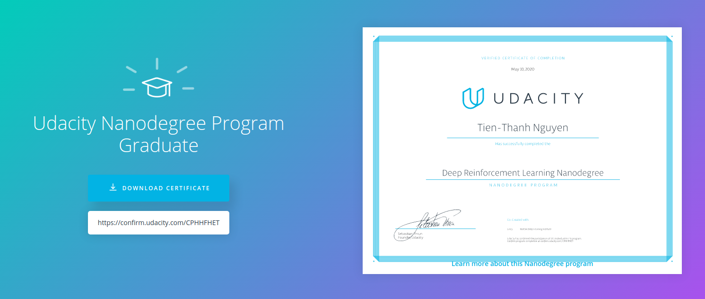

# Udacity - Deep Reinforcement Learning Nanodegree

# Deep Reinforcement Learning
Learn cutting-edge deep reinforcement learning algorithms—from Deep Q-Networks (DQN) to Deep Deterministic Policy Gradients (DDPG). Apply these concepts to train agents to walk, drive, or perform other complex tasks, and build a robust portfolio of deep reinforcement learning projects.

## Foundations of Reinforcement Learning
Master the fundamentals of reinforcement learning by writing your own implementations of many classical solution methods.

## Value-Based Methods
Apply deep learning architectures to reinforcement learning tasks. Train your own agent that navigates a virtual world from sensory data.

## Policy-Based Methods
Learn the theory behind evolutionary algorithms and policy-gradient methods. Design your own algorithm to train a simulated robotic arm to reach target locations.

## Multi-Agent Reinforcement Learning
Learn how to apply reinforcement learning methods to applications that involve multiple, interacting agents. These techniques are used in a variety of applications, such as the coordination of autonomous vehicles.

# Projects of Deep Reinforcement Learning
1.[Navigation](https://github.com/t-thanh/deep-reinforcement-learning/tree/master/P01_Navigation)

[image0]: https://user-images.githubusercontent.com/10624937/42135619-d90f2f28-7d12-11e8-8823-82b970a54d7e.gif "Agent"

![Agent][image1]

Leverage neural networks to train an agent to navigate a virtual world and collect as many yellow bananas as possible while avoiding blue bananas.

2.[Continuous Control](https://github.com/t-thanh/deep-reinforcement-learning/tree/master/P02_Continous_Control)

[image1]: https://user-images.githubusercontent.com/10624937/43851024-320ba930-9aff-11e8-8493-ee547c6af349.gif "Trained Agent"
[image2]: https://user-images.githubusercontent.com/10624937/43851646-d899bf20-9b00-11e8-858c-29b5c2c94ccc.png "Crawler"

![Trained Agent][image1]
![Crawler][image2]

Train a robotic arm to reach target locations. For an extra challenge, train a four-legged virtual creature to walk!

3.[Collaboration and Competition](https://github.com/t-thanh/deep-reinforcement-learning/tree/master/P03_Tennis)

[image3]: https://user-images.githubusercontent.com/10624937/42135623-e770e354-7d12-11e8-998d-29fc74429ca2.gif "Trained Agents"
[image4]: https://user-images.githubusercontent.com/10624937/42135622-e55fb586-7d12-11e8-8a54-3c31da15a90a.gif "Soccer"

![Trained Agents][image3]
![Soccer][image4]

Train a pair of agents to play tennis. For an extra challenge, train a team of agents to play soccer!